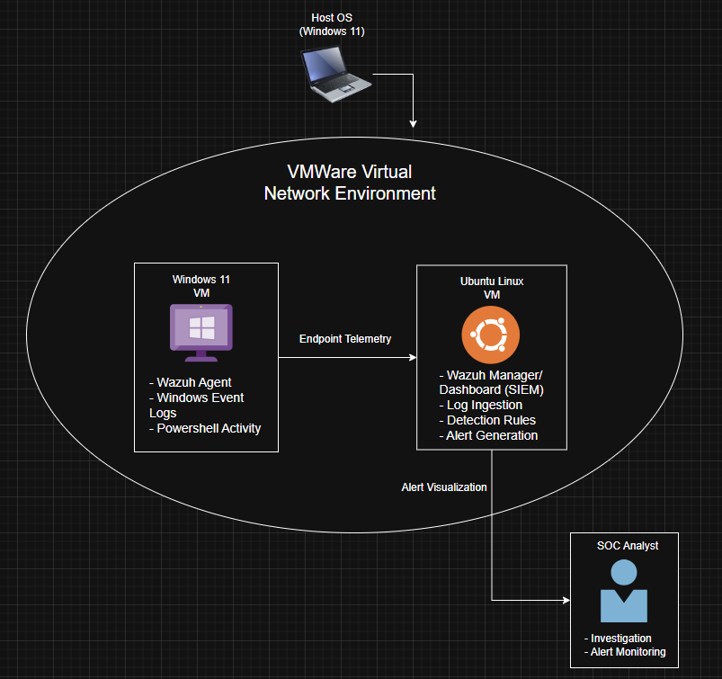

# soc-home-lab-wazuh

SOC home lab project demonstrating endpoint monitoring, log ingestion, and alert investigation using Wazuh in a virtualized environment.

# Windows Endpoint Monitoring with Wazuh

This lab implements a basic Security Operations Center (SOC) monitoring workflow using Wazuh as a SIEM platform. An Ubuntu virtual machine hosts the Wazuh manager and dashboard, while a Windows 11 virtual machine acts as the monitored endpoint running the Wazuh agent. Security events generated on the Windows endpoint are forwarded to the Wazuh server, where detection rules analyze log data and generate alerts. The environment is used to simulate suspicious activity and demonstrate the end-to-end process of log ingestion, alert creation, investigation, and documentation within a controlled virtual environment.

## Objective
This project demonstrates how a Security Information and Event Management (SIEM) platform ingests endpoint logs, generates security alerts, and supports basic incident investigation using a Windows endpoint and a Wazuh server.

## Tools Used
- Wazuh (SIEM platform)
- VMware Workstation (virtualization)
- Ubuntu Linux (Wazuh server)
- Windows 11 (monitored endpoint)
- Windows Event Viewer
- PowerShell
- MITRE ATT&CK Framework
- GitHub (documentation and version control)

## Detection Scenarios
The lab simulates common endpoint security events to demonstrate the detection lifecycle:
- Multiple failed login attempts
- Suspicious PowerShell execution
- Account lockout activity
- Windows security log monitoring
- Endpoint telemetry ingestion into SIEM
- Alert generation and triage
- Mapping alerts to MITRE ATT&CK techniques

## Architecture

The lab architecture consists of two virtual machines connected through a virtual network created in VMware Workstation. An Ubuntu server hosts the Wazuh manager and dashboard, functioning as the SIEM platform responsible for collecting, analyzing, and visualizing security telemetry. A Windows 11 endpoint runs the Wazuh agent, which forwards system and security logs to the Wazuh server for analysis.

Security events generated on the Windows endpoint are transmitted through the Wazuh agent to the Wazuh manager, where detection rules process incoming logs and generate alerts. Analysts access the Wazuh web dashboard to monitor alerts, review log data, and perform investigations. This architecture demonstrates the core SOC workflow of endpoint telemetry collection, centralized log analysis, detection, and incident investigation within a virtualized environment.

## Setup Summary

## Activity / Simulation

## Results

## Investigation

## Challenges

## Lessons Learned

## Future Improvements
