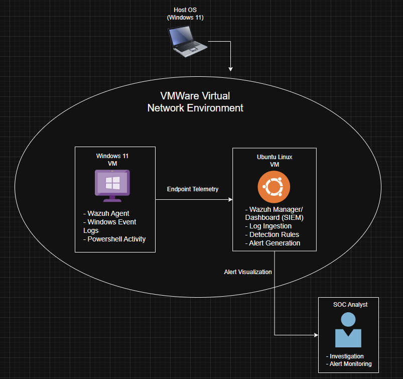

# soc-home-lab-wazuh

SOC home lab project demonstrating endpoint monitoring, log ingestion, and alert investigation using Wazuh in a virtualized environment.

# Windows Endpoint Monitoring with Wazuh

This lab implements a basic Security Operations Center (SOC) monitoring workflow using Wazuh as a SIEM platform. An Ubuntu virtual machine hosts the Wazuh manager and dashboard, while a Windows 11 virtual machine acts as the monitored endpoint running the Wazuh agent. Security events generated on the Windows endpoint are forwarded to the Wazuh server, where detection rules analyze log data and generate alerts. The environment is used to simulate suspicious activity and demonstrate the end-to-end process of log ingestion, alert creation, investigation, and documentation within a controlled virtual environment.

## Objective
This project demonstrates how a Security Information and Event Management (SIEM) platform ingests endpoint logs, generates security alerts, and supports basic incident investigation using a Windows endpoint and a Wazuh server.

## Tools Used
- Wazuh (SIEM platform)
- VMware Workstation (virtualization)
- Ubuntu Linux (Wazuh server)
- Windows 11 (monitored endpoint)
- Windows Event Viewer
- PowerShell
- MITRE ATT&CK Framework
- GitHub (documentation and version control)

## Detection Scenarios
The lab simulates common endpoint security events to demonstrate the detection lifecycle:
- Multiple failed login attempts
- Suspicious PowerShell execution
- Account lockout activity
- Windows security log monitoring
- Endpoint telemetry ingestion into SIEM
- Alert generation and triage
- Mapping alerts to MITRE ATT&CK techniques

## Architecture

The lab architecture consists of two virtual machines connected through a virtual network created in VMware Workstation. An Ubuntu server hosts the Wazuh manager and dashboard, functioning as the SIEM platform responsible for collecting, analyzing, and visualizing security telemetry. A Windows 11 endpoint runs the Wazuh agent, which forwards system and security logs to the Wazuh server for analysis.

Security events generated on the Windows endpoint are transmitted through the Wazuh agent to the Wazuh manager, where detection rules process incoming logs and generate alerts. Analysts access the Wazuh web dashboard to monitor alerts, review log data, and perform investigations. This architecture demonstrates the core SOC workflow of endpoint telemetry collection, centralized log analysis, detection, and incident investigation within a virtualized environment.

## Setup Summary
Wazuh Manager (Ubuntu VM)

   - IP Address: 192.168.147.129

   - RAM: 6 GB

   - CPU: 1 Processor / 2 Cores

   - Role: SIEM (Log collection, analysis, alerting)

An Ubuntu VM was configured as the Wazuh manager with IP 192.168.147.129. The full Wazuh stack (manager, indexer, and dashboard) was installed using the official installation script. After installation, all services were verified to be running, and the dashboard was accessed via the server IP in a web browser. The system was then ready to receive and process logs from connected agents.

Windows 11 Endpoint

   - IP Address: 192.168.147.128

   - RAM: 3 GB

   - CPU: 1 Processor / 2 Cores

   - OS: Windows 11 Enterprise

   - Wazuh Agent Version: 4.14.3

A Windows 11 VM was configured as the monitored endpoint and assigned IP 192.168.147.128. Network connectivity to the Wazuh manager (192.168.147.129) was verified using ping, and ports 1514 and 1515 were confirmed open using Test-NetConnection. The Wazuh agent (v4.14.3) was installed using the MSI installer and configured to connect to the manager. After installation, the Wazuh service was started and verified, and the agent successfully appeared as active in the Wazuh dashboard.

## Alert Simulations
The following simulations were conducted on the Windows 11 endpoint to validate detection capabilities within the Wazuh SIEM environment.  While Wazuh includes built-in rules for many common security events, custom rules were created as part of this project to practice rule development and better understand how detections are defined within the Wazuh configuration files. These rules were tested and validated through controlled attack simulations. A more in depth description of each simulation can be found in the simulations folder.

<u>Multiple Failed Login Attempts (Brute Force):</u>

Simulated repeated failed login attempts to trigger a threshold-based alert. The custom rule detects excessive authentication failures indicative of brute force activity.

<u>User Creation & Privilege Escalation:</u>

Created a new user account and added it to the Administrators group. Custom rules detect both account creation and unauthorized privilege escalation events.

<u>Suspicious Service Creation:</u>

Simulated the creation of a new Windows service using command-line tools. The custom rule identifies service creation as a potential persistence mechanism.

<u>Sensitive File Modification:</u>

Modified a monitored file to simulate unauthorized access. File Integrity Monitoring detects changes to sensitive files and generates an alert.

<u>Suspicious PowerShell Activity:</u>

Executed encoded or suspicious PowerShell commands to identify potentially malicious powershell activity. 

## Results

## Investigation

## Challenges

## Lessons Learned

## Future Improvements
