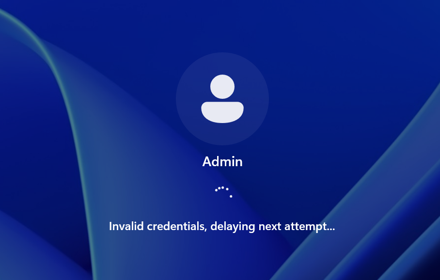
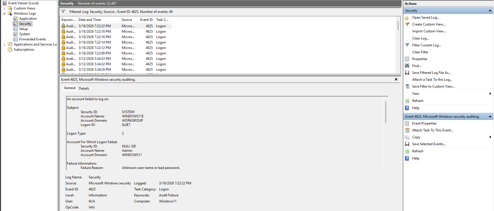
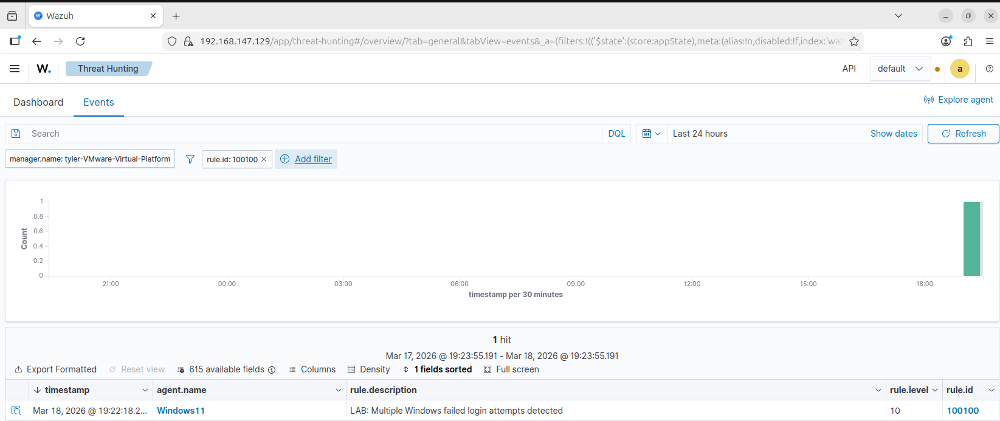

# Failed Login Attempts Detection

## Overview

This simulation tests the detection of multiple failed login attempts on a Windows endpoint, which may indicate a brute force or password spraying attack.

A custom Wazuh rule was configured to trigger an alert when multiple failed login events (Event ID 4625) occur within a defined timeframe.

---

## Simulation Steps

1. Attempted multiple failed logins on the Windows 11 VM using an incorrect password for the "Admin" account
2. Repeated login attempts to trigger the threshold defined in the custom rule
3. Verified that Windows Event Logs recorded the failed login events (Event ID 4625)
4. Investigated alert on Wazuh Dashboard/Threat Hunting interface

---
## Failed Login Attempt Simulation

The following screenshot shows repeated failed login attempts on the Windows endpoint using invalid credentials for the "Admin" account. These attempts were intentionally performed to simulate a brute force or password spraying scenario.

## Log Evidence (Windows Event Viewer)

The failed login attempts were successfully recorded in the Windows Security log.

- Event ID: **4625**
- Description: **An account failed to log on**
- Failure Reason: **Unknown user name or bad password**

## Wazuh Alert Detection

The custom Wazuh rule successfully detected multiple failed login attempts and generated an alert.

- Rule ID: **100100**
- Alert Level: **10**
- Description: **Multiple Windows failed login attempts detected**

---

## Detection Logic

This alert is triggered when:

- Multiple Event ID 4625 logs are generated
- The number of events meets the defined frequency threshold
- Events occur within the configured timeframe

The rule uses correlation with an existing Wazuh rule (`if_matched_sid`) to ensure accurate detection.

---

## Security Impact

Multiple failed login attempts may indicate:

- Brute force attack
- Password spraying
- Unauthorized access attempts

If successful, this type of attack could lead to account compromise and privilege escalation.
