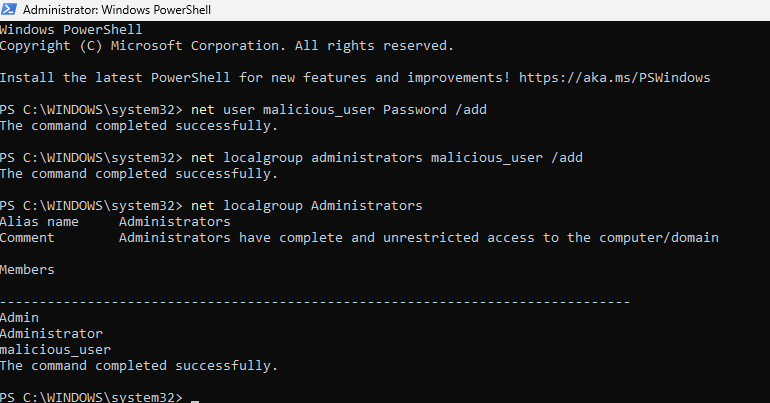
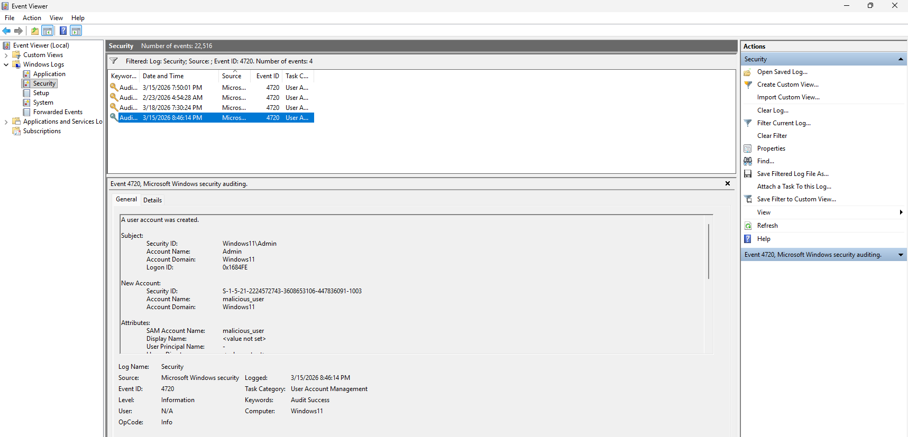
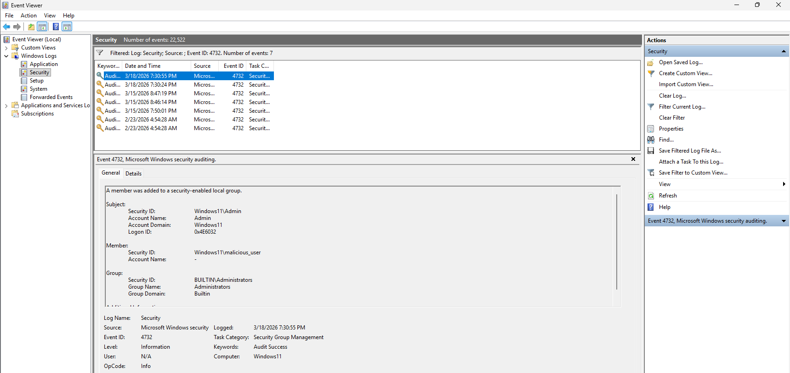
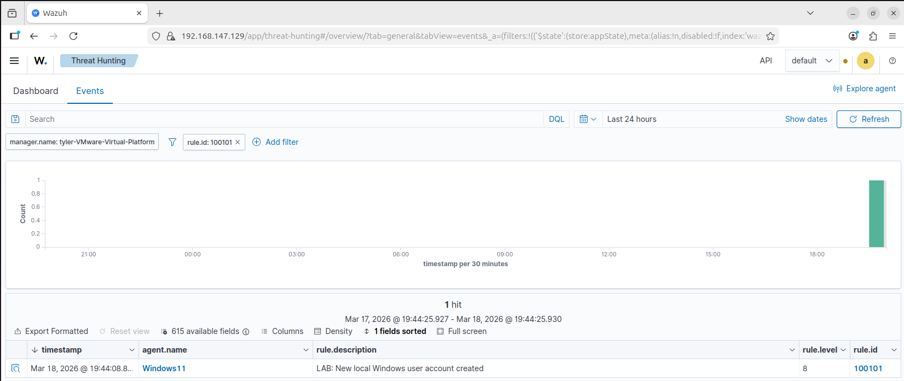
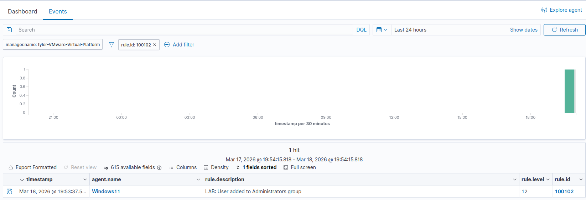

# New User Creation & Privilege Escalation Detection

## Overview

This simulation tests the detection of new user account creation followed by privilege escalation through addition to the local Administrators group.

These actions represent common attacker behavior after initial access, where persistence and elevated privileges are established.

Custom Wazuh rules were configured to detect:

- New user account creation (Event ID 4720)
- User added to Administrators group (Event ID 4732)

---

## Simulation Steps

1. Created a new local user on the Windows 11 VM using PowerShell:
   - `net user malicious_user Password /add`

2. Added the user to the local Administrators group:
   - `net localgroup administrators malicious_user /add`

3. Verified the user was successfully added to the Administrators group

4. Checked the Windows Event Viewer Security logs to confirm log generation:
   - Event ID **4720** for user creation
   - Event ID **4732** for group membership change

5. Searched for and verified corresponding alerts in the Wazuh dashboard using rule IDs:
   - **100101** (user creation)
   - **100102** (privilege escalation)
---

## User Creation & Privilege Escalation Simulation

The following screenshot shows the creation of a new user account and the addition of that user to the Administrators group using PowerShell.

---

## Log Evidence (Windows Event Viewer)

### New User Creation (Event ID 4720)

The creation of a new user account was recorded in the Windows Security log.

- Event ID: **4720**
- Description: **A user account was created**

---

### Privilege Escalation (Event ID 4732)

The addition of the user to the Administrators group was recorded as a security group modification.

- Event ID: **4732**
- Description: **A member was added to a security-enabled local group**

---

## Wazuh Alert Detection

### New User Creation Alert

The custom Wazuh rule successfully detected the creation of a new user account.

- Rule ID: **100101**
- Alert Level: **8**
- Description: **New local Windows user account created**

---

### Privilege Escalation Alert

The custom Wazuh rule detected the addition of the user to the Administrators group.

- Rule ID: **100102**
- Alert Level: **12**
- Description: **User added to Administrators group**

---

## Detection Logic

These alerts are triggered when:

- Event ID **4720** is generated for new user account creation
- Event ID **4732** is generated for group membership changes
- The rules leverage `if_matched_sid` to correlate with existing Wazuh detection logic

This ensures reliable detection while building on Wazuh’s native capabilities.

---

## Security Impact

This behavior is highly suspicious and may indicate:

- Unauthorized account creation
- Privilege escalation by an attacker
- Establishment of persistence within the system

If left undetected, this could allow an attacker to maintain long-term administrative access.

This simulation demonstrates how user account creation and privilege escalation can be detected and investigated using Wazuh. The custom rules successfully identified both actions and generated alerts that provide clear indicators of potential compromise.
