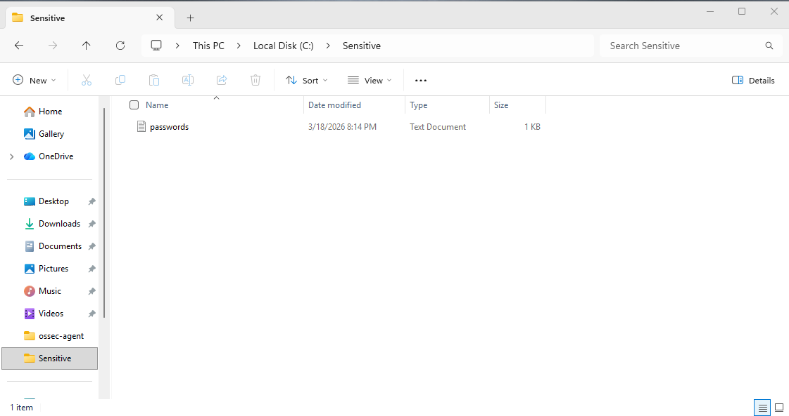
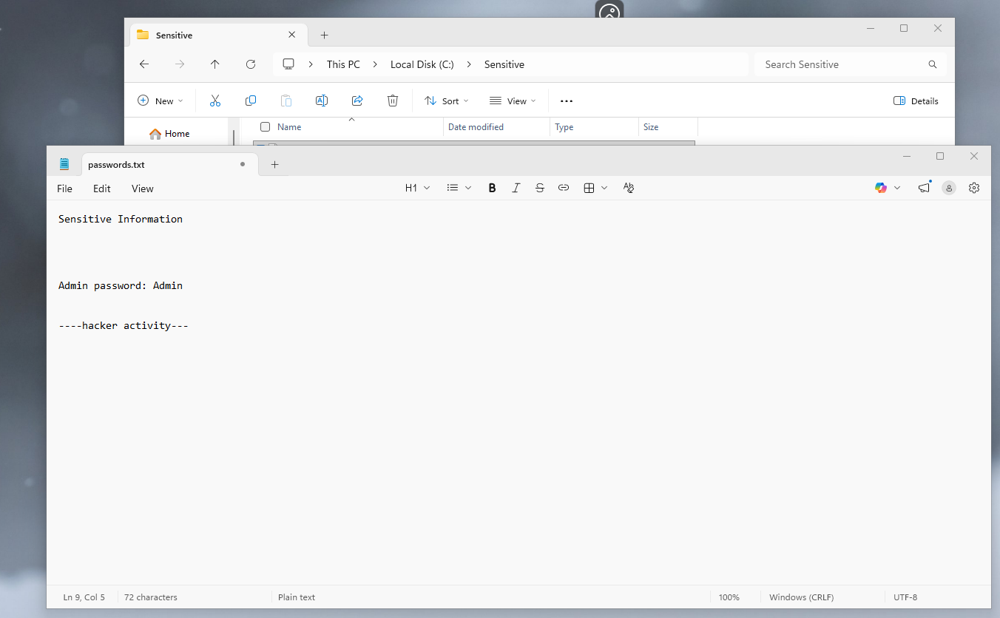
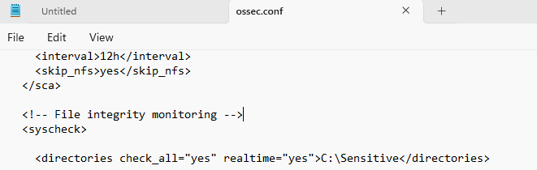
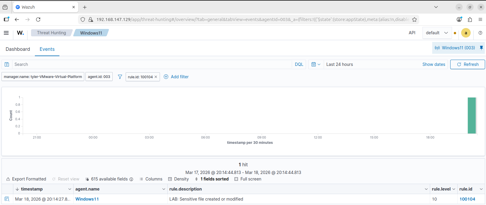

# Sensitive File Modification Detection

## Overview

This simulation tests the detection of changes to a sensitive file using Wazuh's File Integrity Monitoring (FIM) capabilities.

Monitoring sensitive files is critical for detecting unauthorized access, data tampering, or potential credential exposure. A custom Wazuh rule was configured to alert when a specific file is created or modified.

---

## Simulation Steps

1. Created a directory on the Windows 11 VM to store sensitive data:
   - `C:\Sensitive`

2. Created a file named `passwords.txt` inside the directory

3. Added sensitive content to the file to simulate confidential data

4. Modified the file to simulate unauthorized changes

5. Manually configured File Integrity Monitoring (FIM) in the Wazuh agent to monitor the specific folder:
   - `C:\Sensitive`

6. Checked the Wazuh dashboard to confirm detection of the file change:
   - Rule ID **100104**

---

## Sensitive File Simulation

The following screenshots show the creation and modification of a sensitive file containing simulated confidential information.

---

## Log Evidence (File Integrity Monitoring)

File Integrity Monitoring (FIM) was manually configured on the Wazuh agent to monitor a specific sensitive file:

- Monitored Path: **C:\Sensitive**
- Monitoring Type: **Real-time file integrity monitoring (syscheck)**

The configuration was added directly to the Wazuh agent configuration file (`ossec.conf`), enabling detection of file creation and modification events.

---

## Wazuh Alert Detection

The custom Wazuh rule successfully detected the creation or modification of the sensitive file.

- Rule ID: **100104**
- Alert Level: **10**
- Description: **Sensitive file created or modified**

---

## Detection Logic

This alert is triggered when:

- A file within the monitored directory (`C:\Sensitive`) is created or modified
- The Wazuh syscheck module detects a change in file integrity
- The custom rule matches the specific file path (`passwords.txt`)

This ensures targeted monitoring of sensitive data locations.

---

## Security Impact

Modification of sensitive files may indicate:

- Unauthorized access to confidential data
- Credential exposure or tampering
- Insider threats or malicious activity

If undetected, this could lead to data breaches, privilege escalation, or further compromise of the system.
