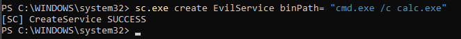
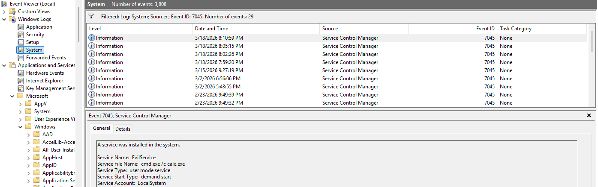
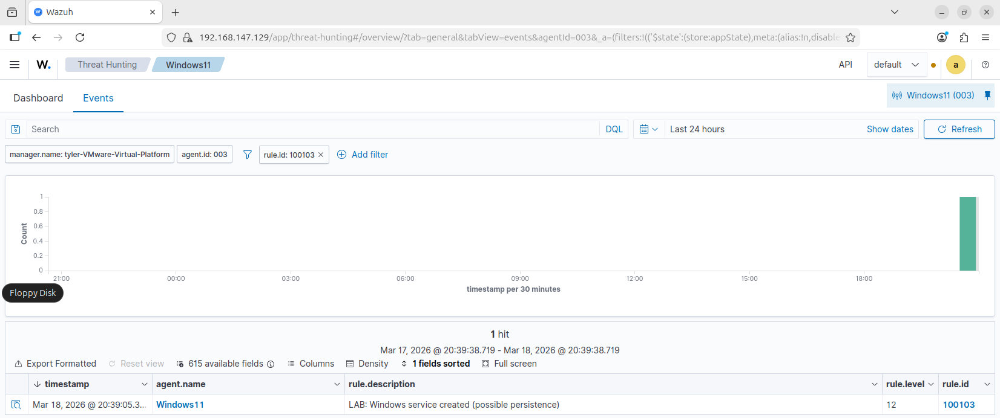

# Suspicious Service Creation Detection

## Overview

This simulation tests the detection of a newly created Windows service, which may indicate a persistence mechanism used by an attacker.

Attackers commonly create malicious services to maintain access to a system and execute code with elevated privileges.

A custom Wazuh rule was configured to detect service creation events (Event ID 7045).

---

## Simulation Steps

1. Created a new service on the Windows 11 VM using PowerShell:
   - `sc.exe create EvilService binPath= "cmd.exe /c calc.exe"`

2. Confirmed the service was successfully created

3. Checked the Windows Event Viewer System logs to verify log generation:
   - Event ID **7045** for service installation

4. Searched for and verified the corresponding alert in the Wazuh dashboard:
   - Rule ID **100103**

---

## Service Creation Simulation

The following screenshot shows the creation of a new service using the Windows `sc.exe` command.

---

## Log Evidence (Windows Event Viewer)

The service creation event was successfully recorded in the Windows System log.

- Event ID: **7045**
- Description: **A service was installed in the system**
- Service Name: **EvilService**

---

## Wazuh Alert Detection

The custom Wazuh rule successfully detected the creation of a new service and generated an alert.

- Rule ID: **100103**
- Alert Level: **12**
- Description: **Windows service created (possible persistence)**

---

## Detection Logic

This alert is triggered when:

- Event ID **7045** is generated in the Windows System log
- A new service is installed on the system
- The rule leverages `if_matched_sid` to correlate with existing Wazuh detection logic

This approach ensures accurate detection of service-based persistence techniques.

---

## Security Impact

Service creation can indicate:

- Persistence mechanisms used by attackers
- Execution of malicious binaries with elevated privileges
- Unauthorized system modifications

If exploited, this technique allows attackers to maintain long-term access and execute code automatically on system startup.
