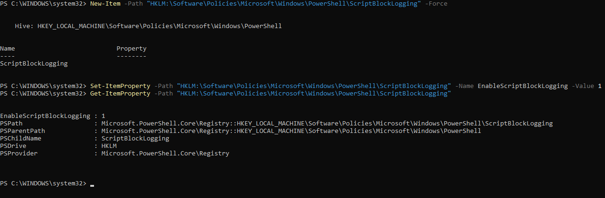
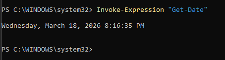
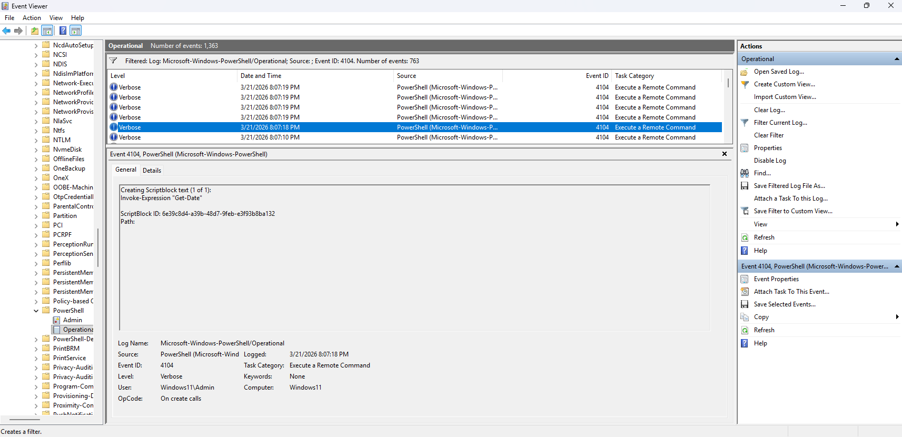
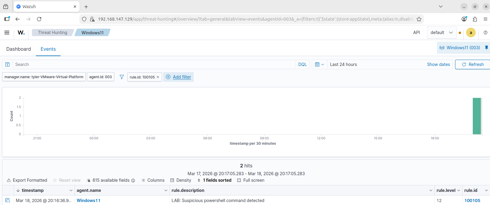

# Suspicious PowerShell Activity Detection

## Overview

This simulation tests the detection of suspicious PowerShell command execution using Wazuh.

PowerShell is commonly abused by attackers for command execution, obfuscation, and living-off-the-land techniques. A custom Wazuh rule was configured to detect potentially suspicious PowerShell activity based on command patterns.

---

## Simulation Steps

1. Executed a PowerShell command on the Windows 11 VM:
   - `Invoke-Expression "Get-Date"`

2. Verified that the command executed successfully in the PowerShell terminal

3. Checked the Windows Event Viewer PowerShell logs to confirm log generation:
   - Event ID **4104** (Script Block Logging)

4. Searched for and verified the corresponding alert in the Wazuh dashboard:
   - Rule ID **100105**

---

## PowerShell Logging Configuration

PowerShell Script Block Logging was manually enabled on the Windows endpoint to capture detailed command execution logs.

This was configured using the Windows registry:

- Path: `HKLM:\Software\Policies\Microsoft\Windows\PowerShell\ScriptBlockLogging`
- Setting: `EnableScriptBlockLogging = 1`

This configuration allows visibility into executed PowerShell commands and enables detection of suspicious activity through Event ID **4104**.

---

## Suspicious PowerShell Simulation

The following screenshot shows execution of a PowerShell command that is commonly associated with dynamic or potentially unsafe execution.

---

## Log Evidence (PowerShell Logging)

The PowerShell command execution was captured using Script Block Logging.

- Event ID: **4104**
- Log Source: **Microsoft-Windows-PowerShell/Operational**
- Command Observed: **Invoke-Expression "Get-Date"**

This logging provides visibility into executed PowerShell commands and is critical for detecting malicious activity.

---

## Wazuh Alert Detection

The custom Wazuh rule successfully detected suspicious PowerShell command execution.

- Rule ID: **100105**
- Alert Level: **12**
- Description: **Suspicious PowerShell command detected**

---

## Detection Logic

This alert is triggered when:

- PowerShell Script Block Logging (Event ID 4104) is generated
- The executed command matches suspicious patterns such as:
  - `Invoke-Expression (IEX)`
  - Encoded commands
  - Download or execution functions

The rule uses pattern matching to identify potentially malicious command behavior.

---

## Security Impact

Suspicious PowerShell activity may indicate:

- Command execution by an attacker
- Use of obfuscated or encoded scripts
- Download and execution of malicious payloads
- Living-off-the-land attack techniques

If undetected, this activity can lead to full system compromise and lateral movement within the network.
