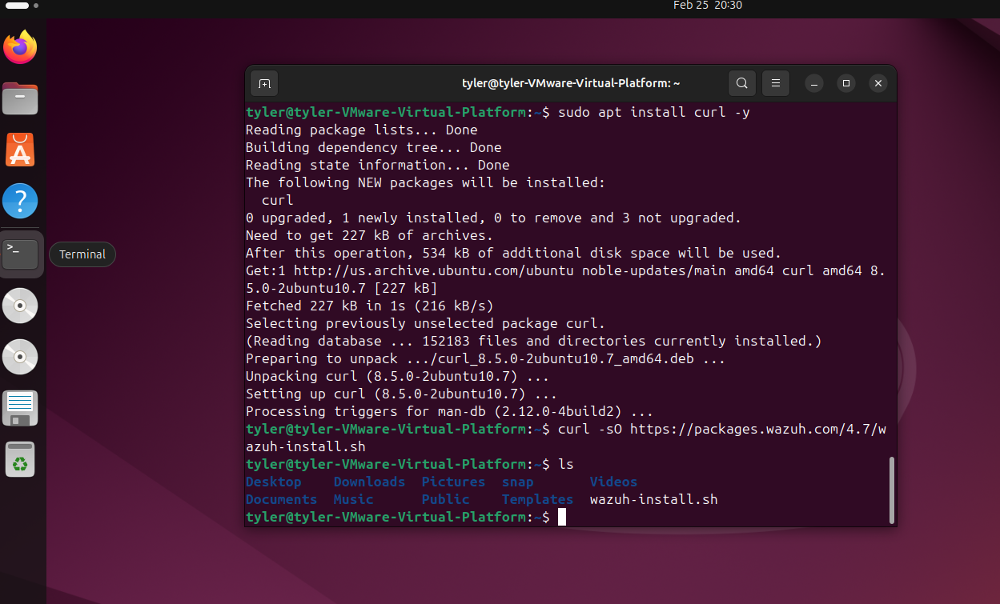
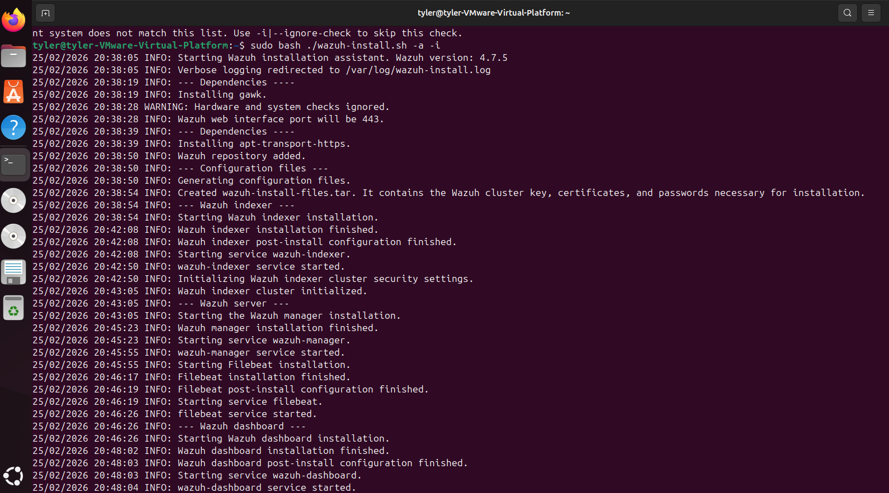
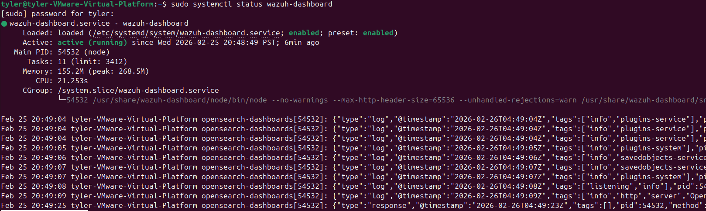
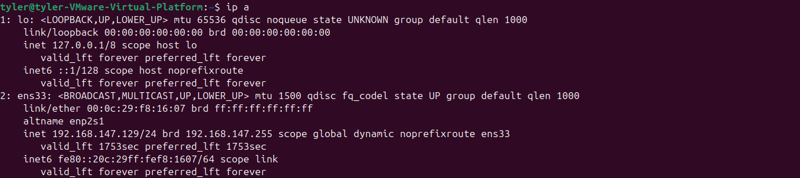
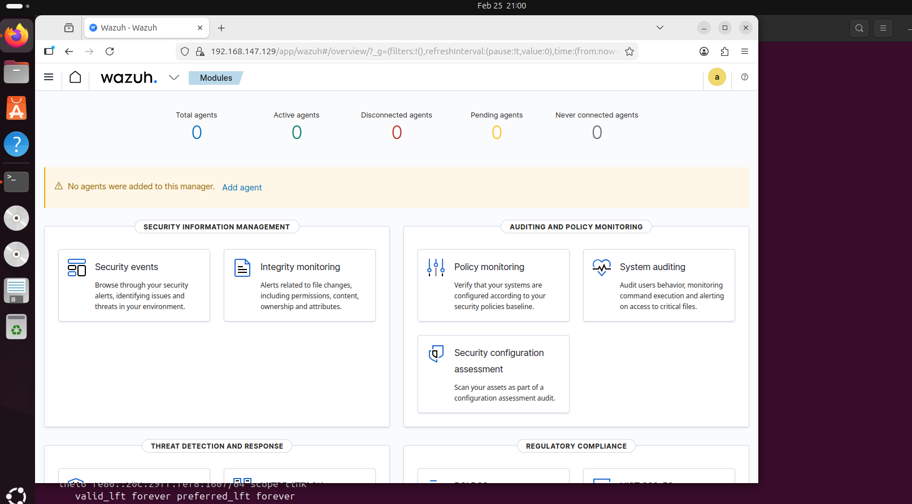

Notes: 

-Ubuntu version: Ubuntu 24.04.4 LTS

-VM specs: 6GB Ram , 1 Processor , 4 Cores

-Network mode: NAT

-Install Command:   Install Script = curl -sO https://packages.wazuh.com/4.7/wazuh-install.sh     
                    Download Script = (original) sudo bash wazuh-install.sh -a  ----->  (adjusted) sudo bash ./wazuh-install.sh -a -i

-Time install took: 15 mins

-Issues:

  -incompatibility with wazuh and my ubuntu version
     
      Changed command to ignore compatibility: sudo bash ./wazuh-install.sh -a -i
              - added ./ to target specific file in folder and -i to ignore the unexpected verion

Terminal during install

Wazuh Download

Confirm Services Running

Wazuh IP

Waszuh dashboard

