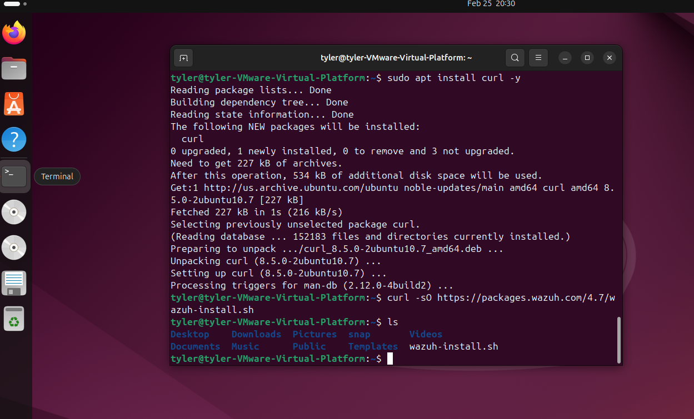
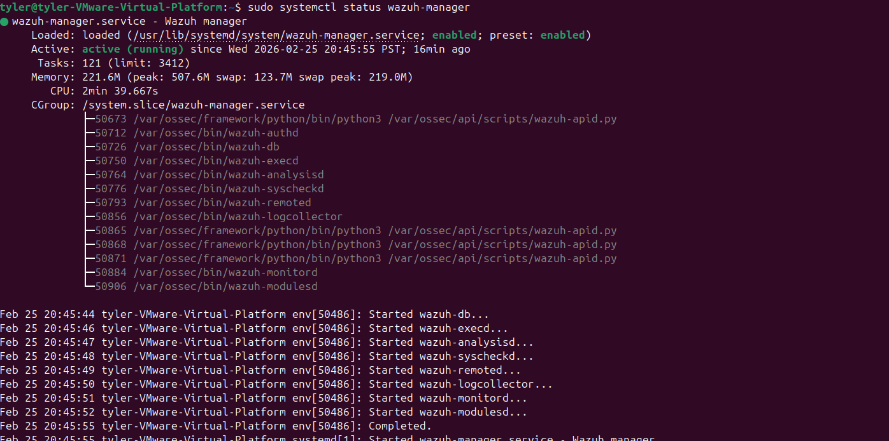
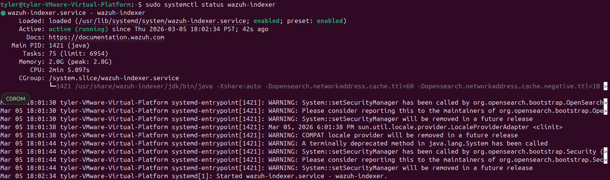
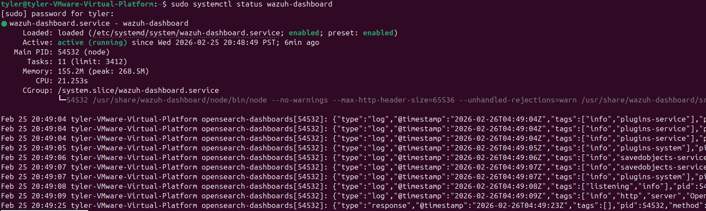
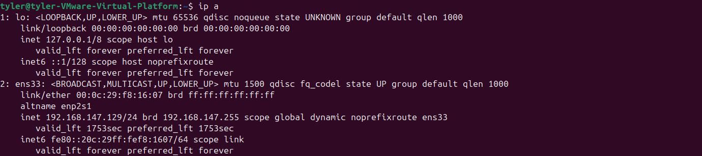
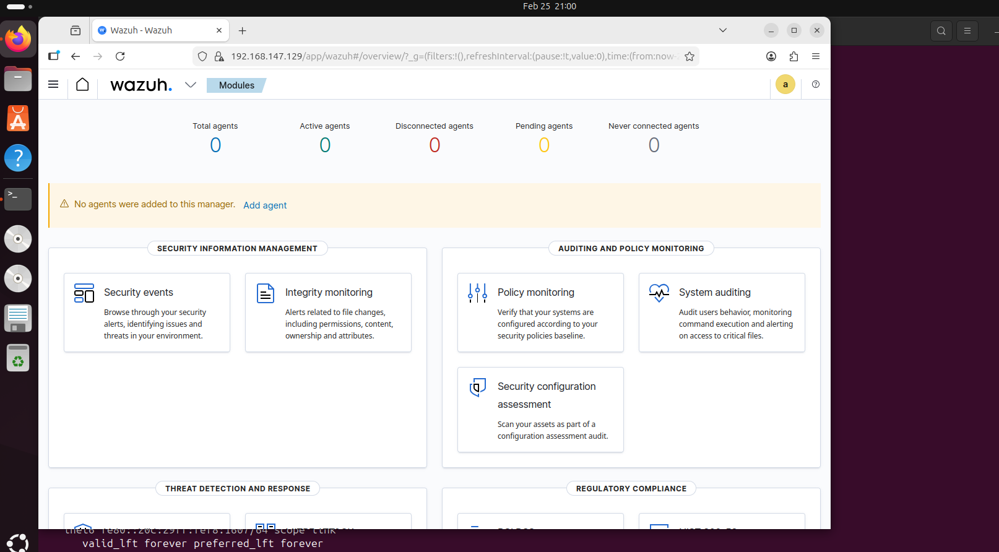

## Ubuntu Wazuh Manager Setup

This section documents the configuration of the Wazuh manager running on an Ubuntu virtual machine.  
The manager is responsible for collecting logs, analyzing security events, and generating alerts from connected endpoints.

##Lab Enviornment Configuration

Ubuntu VM
Operating System: Ubuntu
Role: Wazuh Manager / SIEM Server

Network configuration:
Ubuntu Wazuh Manager IP: 192.168.147.129
Windows Endpoint IP: 192.168.147.128

(include vm specs)

##Downloading/Installing Wazuh Package

The Wazuh installation package was downloaded from the official Wazuh repository.

The Wazuh installation script was executed on the Ubuntu server to deploy the full SIEM stack.

Command for install: sudo ./wazuh-install.sh -a

The installer configures and installs:

• Wazuh Manager

• Wazuh Indexer

• Wazuh Dashboard

The installation process automatically configures services, generates certificates, and initializes the Wazuh cluster.

##Verifying Wazuh Services

After installation, system services were verified to confirm the Wazuh platform components were running.

The following services must be active:

• wazuh-manager

• Wazuh Indexer

• wazuh-dashboardng

## Identifying the Wazuh Server IP Address

The Ubuntu server IP address was identified using the ip a command.

This IP address is required for:

• Accessing the Wazuh web dashboard
• Connecting endpoint agents

## Accessing the Wazuh Dashboard

After the services were confirmed running, the Wazuh dashboard was accessed through a web browser using the server IP address.

Dashboard URL:

https://192.168.147.129

The dashboard provides visibility into:

• Connected agents
• Security alerts
• Log analysis
• Threat detection events

## Wazuh Manager Ready for Endpoint Monitoring

With the Wazuh platform fully installed and operational, the system is ready to receive logs and telemetry from endpoint agents.

The next step in the lab involves installing the Wazuh agent on the Windows endpoint and connecting it to the manager.

