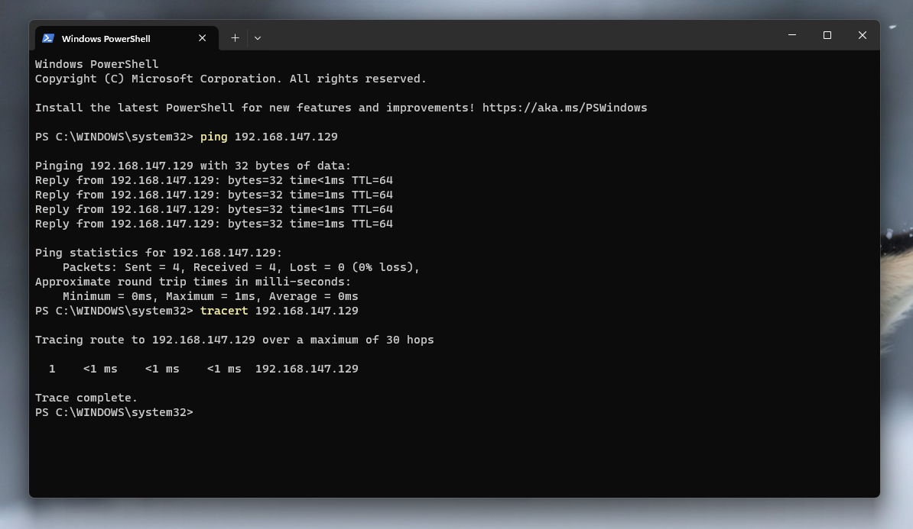
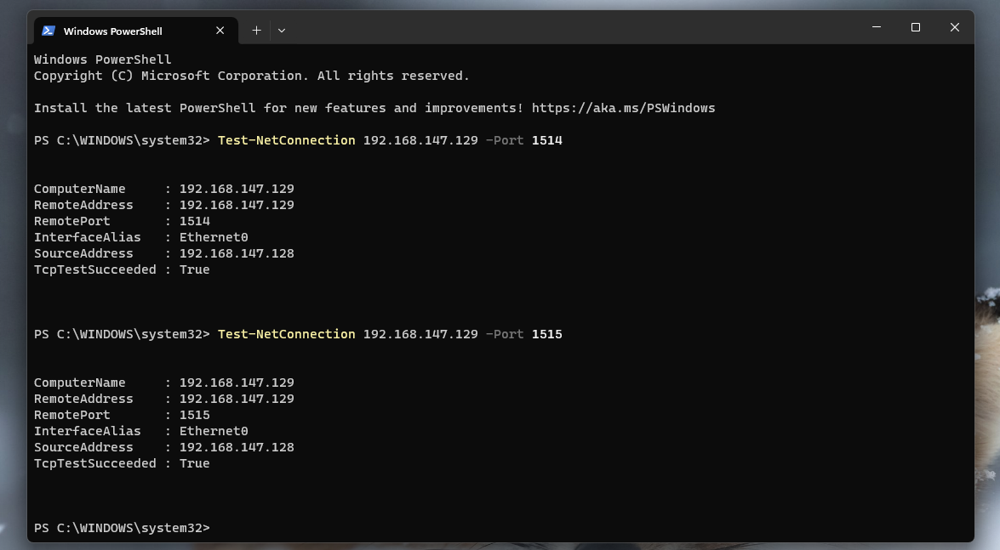
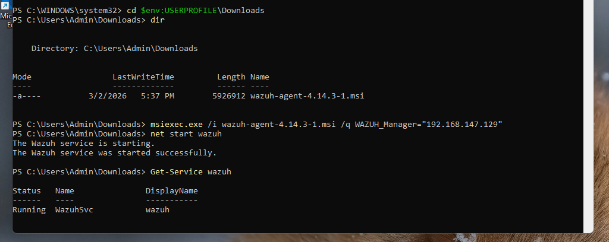
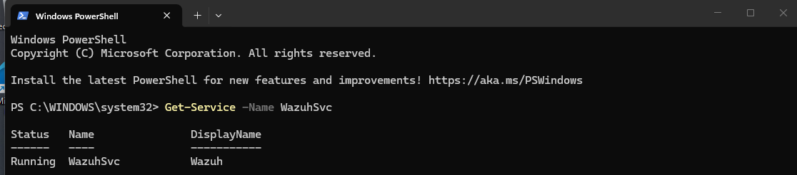
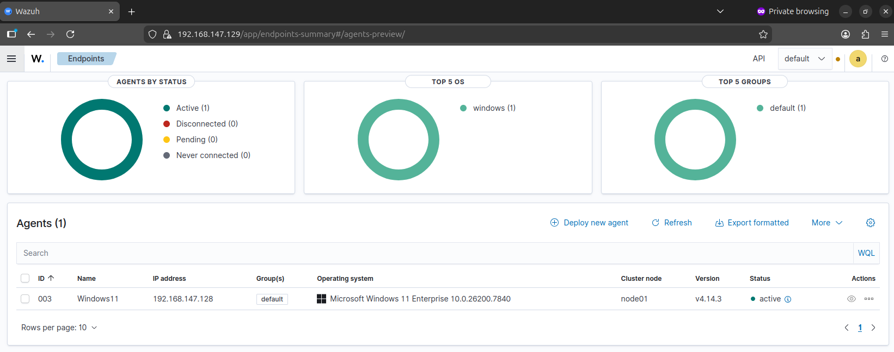
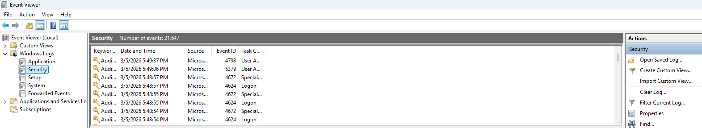

## Windows 11 Endpoint Setup

This section documents the configuration of the Windows 11 endpoint used in the Wazuh SOC home lab.

The Windows system is configured with the Wazuh agent which communicates with the Wazuh manager running on an Ubuntu server VM.

## Environment Configuration

Environment:

Ubuntu VM IP: 192.168.147.129
   - 6GB RAM
   - 1 Processor
   - 2 Cores per processor

Windows VM IP: 192.168.147.128
   - 3GB Ram
   - 1 Processor
   - 2 Cores per processor
   - Agent Version: 4.14.3
   - Operating System: Windows 11 Enterprise

## Network Connectivity Verification

Before installing the Wazuh agent, network connectivity between the Windows endpoint and the Wazuh manager was verified using ping and traceroute.

The results confirm successful communication between the two systems.

## Wazuh Agent Port Connectivity Test

Ports 1514 and 1515 are used by Wazuh agents to communicate with the manager.

Using Test-NetConnection confirmed that both ports are reachable from the Windows endpoint.

## Downloading/Installing the Wazuh Agent

The Wazuh agent installer was downloaded from the official Wazuh repository online.

File used: wazuh-agent-4.14.3-1.msi

The Wazuh agent was installed silently using the MSI installer and configured to connect directly to the Wazuh manager IP address.

## Verifying Wazuh Agent Service

After installation the Wazuh service was started and verified using PowerShell.

The service status confirms the agent is running successfully.

## Agent Registration in Wazuh Dashboard

After the agent connected successfully, the Windows endpoint appeared in the Wazuh dashboard under the Endpoints section.

The agent status shows as Active indicating successful communication with the Wazuh manager.

## Verifying Windows Event Log Collection

Through the Windows Event Viewer, we can confirm that logs are being generated from the Windows 11 vm as seen in the security logs. EventID 4624 is shown confirming successful login

The Windows 11 endpoint is now successfully connected to the Wazuh manager and ready for monitoring.

This endpoint will be used to generate security events and simulate attack scenarios for detection testing.

